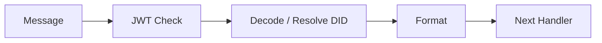
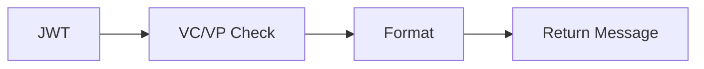
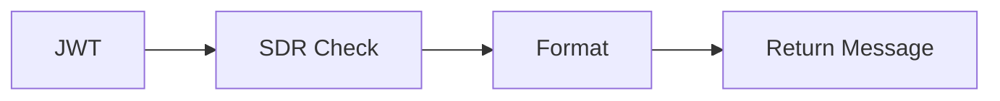

Message handlers implement the AbstractMessageHandler interface and are instantiated as a chain by the Message Handler
plugin. Veramo includes a number of message handlers for you to use in your apps.

When creating the agent instance, you specify the message handlers to use and the order in which they are to be called.
For example, if your app captures Verifiable Credentials from a QR Code, where the data are endcoded as a JWT, you would
specify the url, did-jwt and credential-w3c handlers, in that order, in your agent setup.

## Core Supported Message Handlers

The following plugins export a message handling method.

### `url`

[url](../api/url-handler.md) • [UrlMessageHandler](../api/url-handler.urlmessagehandler.md)

UrlMessageHandler parses a message from a URL, typically from a query string. Further parsing is likely performed in the
JWT and/or DIDComm handlers. The handler supports fetching of shortened URL redirects.

### `did-comm`

[did-comm](../api/did-comm.md) • [DIDCommMessageHandler](../api/did-comm.didcommmessagehandler.md)

DIDCommMessageHandler decrypts incoming messages using the private key of the recipient. The decrypted message is passed
along to subsequent Message Handlers.

### `did-jwt`

[did-jwt](../api/did-jwt.md) • [JWTMessageHandler](../api/did-jwt.jwtmessagehandler.md)

JWTMessageHandler decodes a JWT and creates a message object.

### `credential-w3c`

[credential-w3c](../api/credential-w3c.md) • [W3CMessageHandler](../api/credential-w3c.w3cmessagehandler.md)

W3CMessageHandler checks the message payload for Verifiable Credentials and Verifiable Presentations and formats the
message object accordingly.

### `selective-disclosure`

[selective-disclosure](../api/selective-disclosure.md)
• [SDRMessageHandler](../api/selective-disclosure.sdrmessagehandler.md)

SDRMessageHandler checks the message payload for Selective Disclosure Request and formats the message object
accordingly.
Learn more about selective disclosure requests in the next section.

